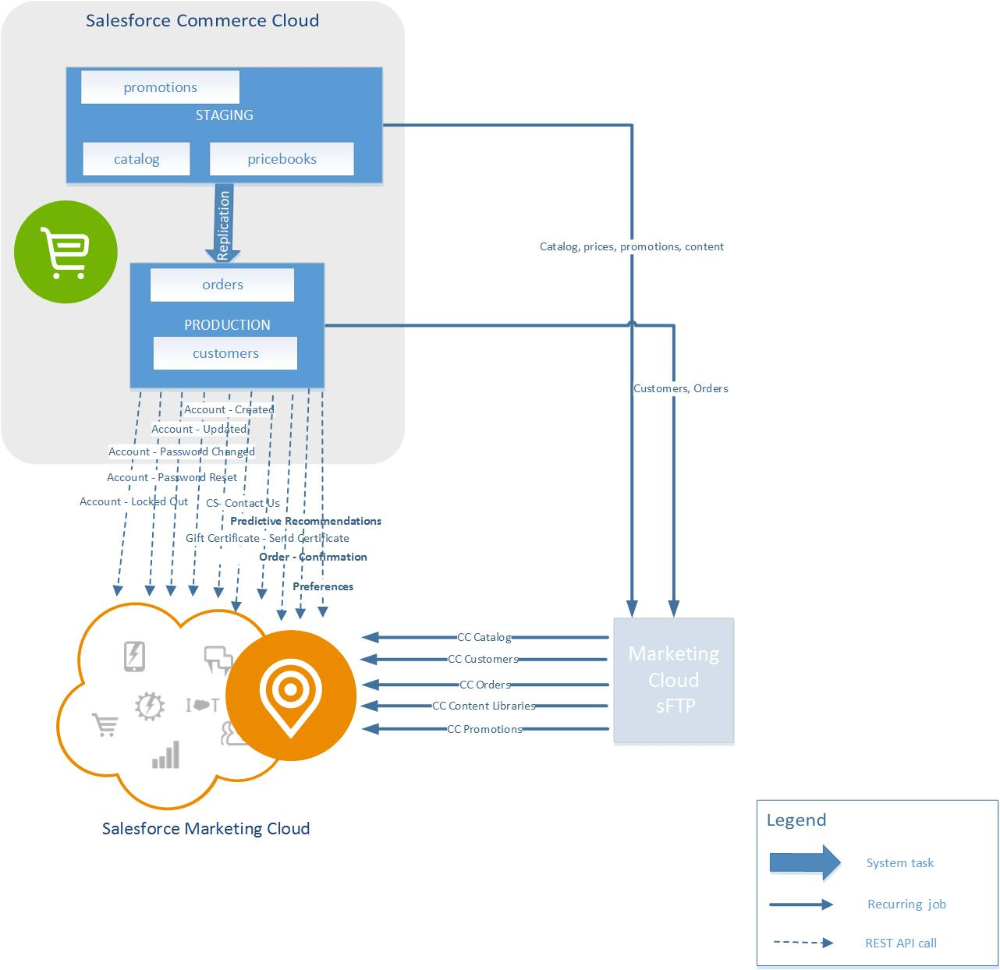

<a name="Top"></a>
# marketing-cloud-connector 

### Navigation
1. [**Project Overview**](1_0_Project_Overview.md#navlink)
2. [Install B2C Commerce Components](2_0_Commerce_Cloud_Component_Installation.md#navlink)
	
	2.1 [Handler Framework Installation](2_1_Handler-Installation.md#navlink)
	
	2.2 [Marketing Cloud Cartridge Installation](2_2_MarketingCloudCart.md#navlink)
	
	2.3 [SFRA Modification Instructions](2_3_Modification-Instructions-for-SFRA.md#navlink)
	
	2.4 [SiteGenesis Modification Instructions](2_4_Modification-Instructions-for-SiteGenesis.md#navlink)
		
	2.5 [Manual Modification Instructions](2_5_ManualModifications.md#navlink)

7. [Install Marketing Cloud Components](3_0_ModifyMarketingCloud.md#navlink)

	3.1 [Triggered Send and Transactional Emails](3_1_0_TriggeredSendTransactionalEmails.md#navlink)
	
	3.1.1 [Triggered Send Configuration](3_1_1_MCConnectorInstallation-TriggeredSendConfiguration.md#navlink)
	
	3.2 [Realtime Analytics Configuration](3_2_MCConnectorInstallation-RealtimeAnalyticsConfiguration.md#navlink)
	
11. [Additional Features](4_0_AdditionalFeatures.md#navlink)
12. [Debugging](5_0_Debugging.md#navlink)

<a name="navlink"></a>
## 1. Project and Architectural Overview  

The Marketing Cloud Connector is a reusable code asset to support the enablement and acceleration of specific integration use cases between B2C Commerce and Marketing Cloud. B2C Commerce Reference Architectures are used as a reference storefront for connector cartridge integration. 

## Features and Requirements

New functionality will be added to the Marketing Cloud Connector cartridge incrementally. 

### Requirements

**Transactional Emails**

The following Reference Architecture emails are replaced with Marketing Cloud email triggers: 

- Account - Created
- Account - Updated
- Account - Password Changed
- Account - Password Reset
- Account - Locked Out
- Customer Service - Contact Us
- Gift Certificate - Send Certificate
- Order - Confirmation 

Transactional emails are built using Salesforce B2C Commerce platform hooks leveraging the triggered email functionality in Marketing Cloud. Configurable trigger definitions stored in custom objects support custom trigger keys and support data mapping for each trigger, ranging from predefined attribute values to data extension attributes that you define. You can use a mix and match of Reference Architecture emails with Marketing Cloud emails.

**Data Sync**

Use jobs to sync catalog, content, customer, and order data to Marketing Cloud.

## Integration Architecture Diagram




## Implementation Details

### Implementation Approach

* CommonJS modules are used.
    * One module for the triggers
    * One or more modules for the REST or SOAP service communication
    * No pipelines
    * JSDoc is used for extensive comments
* Hooks are used extensively for integration.
    * Email triggers
    * Incorporating analytics into the template
    * Product and content recommendations
    * Opt-in, opt-out, and marketing preferences
* Mixing of Reference Architecture email with Marketing Cloud triggered email is supported.
* Platform Service Framework is used to communicate with Marketing Cloud.
    * Service ID: marketingcloud.rest.messaging.send
    * Service used globally
    * Endpoints and credentials managed as part of the service credentials configuration
    * Support for site-specific credentials is handled with site ID as the suffix to the credential ID, for example, marketingcloud.rest.auth-SITEID.
* Configuration
    * System preferences to manage:
        * Analytics system preferences: Enable/Disable and Business Unit ID
        * System preferences: Opt-in and Opt-out toggles and user preference enablement
    * Custom objects used for individual trigger configuration
    * Custom objects used for analytic configuration
    * Custom objects used for job configuration (field mapping)

### Integration Cartridge

 **int\_marketing\_cloud File Structure**


```
.
|__api.md
|__cartridges
| |__int_marketing_cloud
| | |__.project
| | |__.tern-project
| | |__cartridge
| | | |__controllers
| | | | |__MCSubscription.js
| | | |__forms
| | | | |__default
| | | | | |__mcpreferences.xml
| | | | | |__mcsubscribe.xml
| | | |__int_marketing_cloud.properties
| | | |__scripts
| | | | |__communication
| | | | | |__account.js
| | | | | |__customerService.js
| | | | | |__giftCertificate.js
| | | | | |__handler.js
| | | | | |__order.js
| | | | | |__util
| | | | | | |__send.js
| | | | |__feeds
| | | | | |__catalog.js
| | | | | |__content.js
| | | | | |__customers.js
| | | | | |__orders.js
| | | | | |__promotions.js
| | | | | |__upload.js
| | | | |__init
| | | | | |__rest.js
| | | | | |__soap.js
| | | | |__jobs
| | | | | |__compileMappingTemplates.js
| | | | | |__triggers.js
| | | | |__lists
| | | | | |__subscription.js
| | | | |__models
| | | | | |__analytic.js
| | | | | |__authToken.js
| | | | | |__dataExport.js
| | | | | |__dataExportStatus.js
| | | | | |__dataExportVelocity.js
| | | | | |__event.js
| | | | | |__export.js
| | | | | |__message.js
| | | | | |__subscriber.js
| | | | | |__trigger.js
| | | | |__Registry.js
| | | | |__tracking
| | | | | |__dataLayer.js
| | | | | |__trackingLink.js
| | | | |__util
| | | | | |__helpers.js
| | | |__templates
| | | | |__default
| | | | | |__marketingcloud
| | | | | | |__preferences.isml
| | | | | | |__subscribe.isml
| | | | |__resources
| | | | | |__forms.properties
| | | |__webreferences2
| | | | |__etframework.wsdl
| | |__hooks.json
| | |__package.json
| | |__steptypes.json
|__package.json
|__README.md
|__reference
| |__comps
| | |__comps-go-here.txt
| |__mc-templates
| | |__abandonedcart-originalcomp.html
| | |__abandonedcart.html
| | |__accountcreatedemail.html
| | |__accountupdatedemail.html
| | |__contactus.html
| | |__giftcert.html
| | |__lockoutemail.html
| | |__orderconfirmation.html
| | |__passwordchangedemail.html
| | |__resetpasswordemail.html
| |__sg-reference-html
| | |__gift-certificate.html
| | |__new-account.html
| | |__order-confirmation-gift-certificate.html
| | |__order-confirmation-japanese.html
| | |__order-confirmation-multiple-items.html
| | |__order-confirmation-multiple-shipments-languages.html
| | |__order-confirmation-multiple-shipments.html
| |__wsdl
| | |__etframework
| | | |__etframework.api.zip
|__sites
| |__site_template
| | |__jobs.xml
| | |__meta
| | | |__custom-objecttype-definitions.xml
| | | |__system-objecttype-extensions.xml
| | |__services.xml
| | |__sites
| | | |__SiteGenesis
| | | | |__custom-objects
| | | | | |__CommunicationHandlers.xml
| | | | | |__MarketingCloudAnalytics.xml
| | | | | |__MarketingCloudAuthToken.xml
| | | | | |__MarketingCloudDataExport.xml
| | | | | |__MarketingCloudDataExportStatus.xml
| | | | | |__MarketingCloudTriggers.xml
| | |__version.txt
```

## Transactional Emails : Implementation Details

Transactional emails use the triggered email functionality in Marketing Cloud.

### REST APIs

We're using REST API for MC Connector implementation.

For more information, see [Intro to Marketing Cloud APIs] (https://developer.salesforce.com/docs/atlas.en-us.mc-apis.meta/mc-apis/index-api.htm).

### Authentication

Marketing Cloud uses OAuth which returns a token upon successful authentication. To avoid authenticating excessively, the retrieved token is stored in a custom object for reuse.

**Standard API Calls**

All calls to REST API (other than the authentication call) are modified to apply the auth header.
If a token is missing or expired, a new token is automatically requested in this process.

### Response Handling

All standard API calls have their response parsed and the response object wrapped.
The object wrapper contains checks indicating if there was a JSON parsing error, such as an auth error.

**API Response Handling Example**

```
return {
    isValidJSON: isJSON,
    isAuthError: isValid401(client),
    responseObj: parsedBody
};
```

The executing code is responsible for reacting to any errors and handling retries.

### Email Hooks

Email sending in the application is abstracted into hooks.

**Communication Hook Execution Sample**

```
dw.system.HookMgr.callHook( "app.communication.account.created", "created", {
    toEmail : customer.profile.email,
    subject : "Your account at www.mystore.com has been created",
    messageBody : someMessageThatWasGeneratedUsingTemplate,
    params : {} // additional parameters passed to the hook, such as forms, customer profile, etc
} );
```

The supported trigger hooks initiated by user interaction are:

* app.communication.account.created
* app.communication.account.updated
* app.communication.account.passwordChanged
* app.communication.account.passwordReset
* app.communication.account.lockedOut
* app.communication.customerService.contactUs
* app.communication.giftCertificate.sendCertificate
* app.communication.order.confirmation


**Communication Hook Implementation Sample**

```
'use strict';
 
/**
 * @typedef {Object} CustomerNotification
 * @property {string} fromEmail The email address the communication is sent from
 * @property {string|array} toEmail The email address the communication is sent to
 * @property {string} subject The communication subject
 * @property {string} messageBody The body of the communication to send
 * @property {Object} params Object containing additional parameters for usage by the hook
 * @property {dw/web/Forms} params.CurrentForms The forms available in current session
 * @property {dw/web/HTTPParameterMap} params.CurrentHttpParameterMap The parameters in current request
 * @property {dw/customer/Customer} params.CurrentCustomer The current customer
 */
  
/**
 * Sends account created notification
 * @param {CustomerNotification} data
 * @returns {{status: string}}
 */
function created(data) {}
 
module.exports = require('dw/system/HookMgr').callHook(
    'app.communication.handler.initialize',
    'initialize',
    'some_handler_id',
    'app.communication.account',
    {
        created: created
    }
);
```

### Simple Email Sending Implementation

To support triggering Marketing Cloud emails, we replaced the current email logic in various locations of the Reference Architecture with the Marketing Cloud alternative. We still support standard email execution.

**Simple Email Hook Implementation**

```
'use strict';
 
var Mail = require('dw/net/Mail');
var ArrayList = require('dw/util/ArrayList');
 
/**
 * @typedef {Object} CustomerNotification
 * @property {string} fromEmail The email address the communication is sent from
 * @property {string|array} toEmail The email address the communication is sent to
 * @property {string} subject The communication subject
 * @property {string} messageBody The body of the communication to send
 * @property {Object} params Object containing additional parameters for usage by the hook
 * @property {dw/web/Forms} params.CurrentForms The forms available in current session
 * @property {dw/web/HTTPParameterMap} params.CurrentHttpParameterMap The parameters in current request
 * @property {dw/customer/Customer} params.CurrentCustomer The current customer
 */
 
/**
 * Send a customer notification email
 * @param {CustomerNotification} data
 * @returns {{status: string}} Response object. At a minimum it should contain a status string: OK= indicates success, ERROR= indicates failure, anything else also indicates failure
 */
function sendEmail(data){
    var email = new Mail();
    email.setTo(new ArrayList(data.toEmail));
    email.setFrom(data.fromEmail);
    email.setSubject(data.subject);
    email.setContent(data.messageBody, 'text/html', 'UTF-8');
    var status = email.send();
 
    return {
        status: !status.isError() ? 'OK' : 'ERROR'
    };
}
 
/**
 * Sends account created notification
 * @param {CustomerNotification} data
 * @returns {{status: string}}
 */
function created(data) {
    return sendEmail(data);
}
 
module.exports = require('dw/system/HookMgr').callHook(
    'app.communication.handler.initialize',
    'initialize',
    'sitegenesis_email',
    'app.communication.account',
    {
        created: created
    }
);
```


## Data Sync : Implementation Details

Catalog, content, order, and customer data are exported to Marketing Cloud.
Custom jobs are built to execute in Business Manager.
Flat-file batch exports are generated at minimum daily.
Each job can be enabled or disabled separately from the other available jobs.

Jobs are defined using the native Job Scheduler as script-based workflows. A job exists for each type of data to be exported.
Custom chunk-oriented job steps are defined for each data extract. A task-oriented job step is defined for the file transfer handling.
Jobs execute at the site level.
The approach used for chunk and task-oriented custom job steps follows the recommendations documented in the Commerce Cloud InfoCenter, at [Creating Custom Jobs](https://documentation.b2c.commercecloud.salesforce.com/DOC1/topic/com.demandware.dochelp/Jobs/CreateCustomJobStep.html).

Feeds and import activities follow the documentation provided for Marketing Cloud:

* [Importing into Data Extensions](https://help.marketingcloud.com/en/documentation/exacttarget/subscribers/data_extensions_for_exacttarget_marketing_cloud/importing_into_a_data_extension/)
* [Create an Import Activity](https://help.marketingcloud.com/en/documentation/exacttarget/interactions/activities/import_activity/)
* [Decompress a compressed import](https://help.marketingcloud.com/en/documentation/exacttarget/interactions/activities/file_transfer_activity/)
* [Enhanced FTP](https://help.marketingcloud.com/en/documentation/exacttarget/resources/enhanced_ftp_guide/)

### File Upload

Job Step ID: custom.MCC-Feed-Upload  
Job Step Type: script-module-step  

### Catalog Export

Job ID: MCC-Feed-Catalog  
Job Step ID: custom.MCC-Feed-ExportCatalog  
Job Step Type: chunk-script-module-step  

### Content Export

Job ID: MCC-Feed-Content  
Job Step ID: custom.MCC-Feed-ExportContent  
Job Step Type: chunk-script-module-step  

### Order Export

Job ID: MCC-Feed-Order  
Job Step ID: custom.MCC-Feed-ExportOrders  
Job Step Type: chunk-script-module-step  

### Customer Export

Job ID: MCC-Feed-Customer  
Job Step ID: custom.MCC-Feed-ExportCustomers  
Job Step Type: chunk-script-module-step  

### Sample Steps JSON

See int\_marketing\_cloud/cartridge/steptypes.json

- - -

[Back to the top](#Top)
