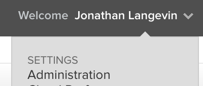
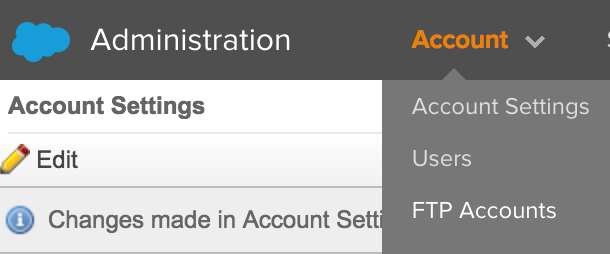
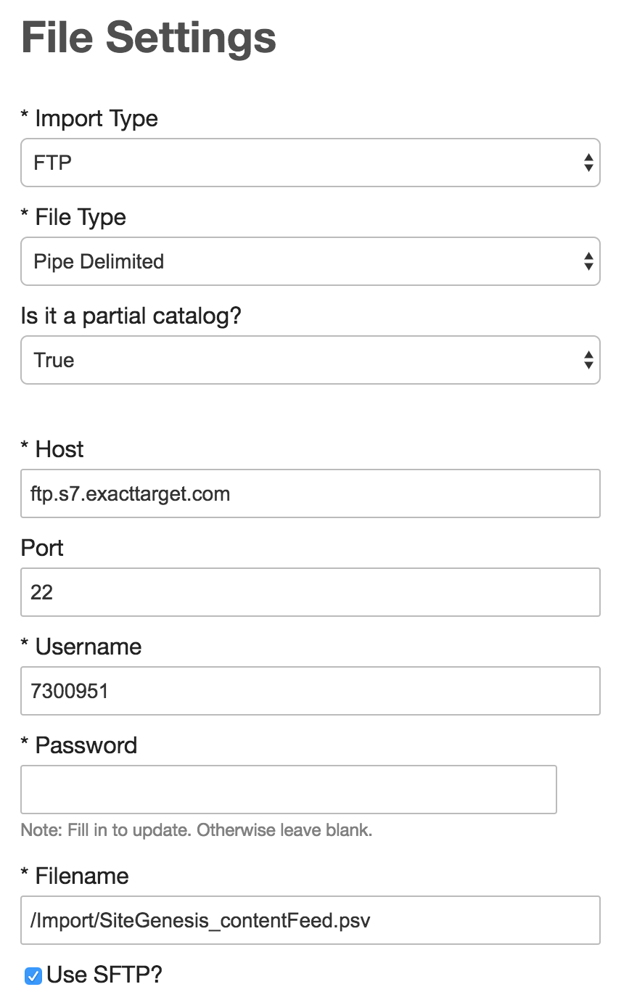
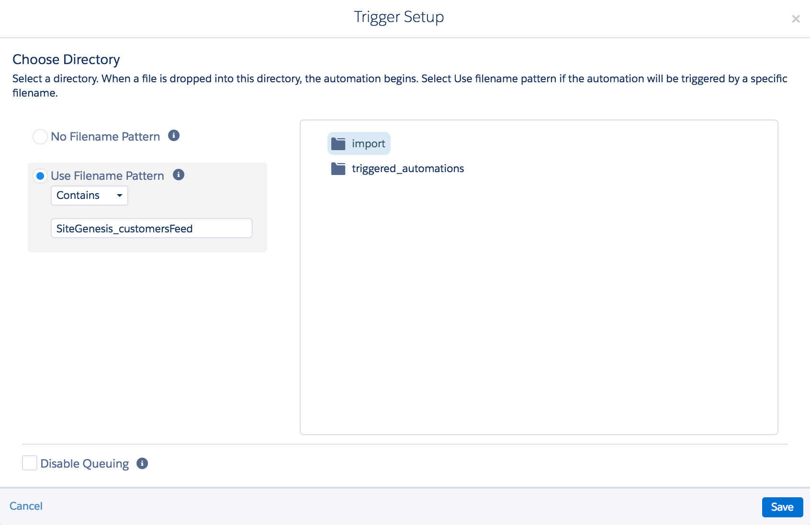
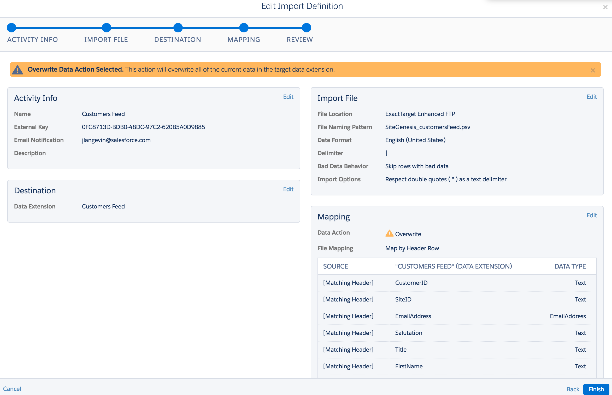

<a name="Top"></a>
# marketing-cloud-connector  

### Navigation
1. [Project Overview](1_0_Project_Overview.md#navlink)
2. [Install B2C Commerce Components](2_0_Commerce_Cloud_Component_Installation.md#navlink)
	
	2.1 [Handler Framework Installation](2_1_Handler-Installation.md#navlink)
	
	2.2 [Marketing Cloud Cartridge Installation](2_2_MarketingCloudCart.md#navlink)
	
	2.3 [SFRA Modification Instructions](2_3_Modification-Instructions-for-SFRA.md#navlink)
	
	2.4 [SiteGenesis Modification Instructions](2_4_Modification-Instructions-for-SiteGenesis.md#navlink)
				
	2.5 [Manual Modification Instructions](2_5_ManualModifications.md#navlink)

7. [Install Marketing Cloud Components](3_0_ModifyMarketingCloud.md#navlink)

	3.1 [Triggered Send and Transactional Emails](3_1_0_TriggeredSendTransactionalEmails.md#navlink)
	
	3.1.1 [Triggered Send Configuration](3_1_1_MCConnectorInstallation-TriggeredSendConfiguration.md#navlink)
	
	3.2 [Realtime Analytics Configuration](3_2_MCConnectorInstallation-RealtimeAnalyticsConfiguration.md#navlink)
	
11. [**Additional Features**](4_0_AdditionalFeatures.md#navlink)
12. [Debugging](5_0_Debugging.md#navlink)

<a name="navlink"></a>
## 4. Additional Features
<a name="CatalogSync"></a>
## Sync Your Catalog ##

### Streaming Updates ###

The Predictive Web feature supports streaming updates for your catalogs. As a product or content item is viewed, details are sent to Marketing Cloud so that the latest information about the item is updated. A caveat to this feature is that you must send the complete details for the product or content item to ensure that you are matching the data structure of the data feed for the product and content catalogs. If fields are omitted, it is assumed those fields are intended to be emptied out.  

### Batch Upload ###

Batch import can occur via a data feed once per day. See [Data Feeds](#DataFeeds) for more information.

<a name="OptIn"></a>
## Marketing Opt In and Subscription Management 

Marketing opt-in and subscription management are available via a new controller included with the cartridge. 

You can use the following controller endpoints.  

- MCSubscription-Manage — Allows a logged-in customer to manage their mailing list preferences, enabling and disabling lists as they desire.
- MCSubscription-Subscribe — A standard email-subscription form page.
- MCSubscription-SubscribeFooter — A standard email-subscription form page without a decorator template applied.
- MCSubscription-Unsubscribe — A standard email-unsubscribe form page.

Hooks have also been added to support subscribe and unsubscribe. The subscribe hook is executed when the marketing opt-in checkbox is selected on the user registration and checkout forms.  

The following preferences are available for you to manage this functionality.  

- Enable Mailing List Hooks — Allows you to turn on and off the hook that executes when the opt-in checkbox is submitted.
- Default Mailing Lists — A list of mailing list IDs that a user is subscribed to by default when using the opt-in checkbox or subscribe forms.
- Mailing Lists Whitelist — A list of mailing list IDs that act as a whitelist to control which lists are displayed to the user on the MCSubscription-Manage page. If left blank, all lists are displayed.


<a name="DataFeeds"></a>
## Data Feeds ##

### Feed Configuration ###

Multiple jobs are defined in the Business Manager Job Scheduler, named with the format `MCC-Feed-`. Within each job, on the Step Configurator tab, is a step named in the format `mcc-feed-export`.

Each export step contains the following fields.

* ExportID — Corresponds to exportID in MarketingCloudDataExport custom objects.
* ExportFileName — Specifies the filename to generate from the job export.
* Delimiter — Options are pipe, comma, or tab character.
* IncrementalExport — Only exports records added or modified since the last execution.

Each job also lists a step named `mcc-feed-upload` with the following fields.

* SFTPServiceID — ID of the [S]FTP service configured in **Administration > Operations > Services**.
* ExportFileName — Filename of the exported feed, as configured in the export step.
* TargetPath — The directory path for the file to upload to on the destination [S]FTP server.

The MarketingCloudDataExport custom objects that are defined for each export job provide  field mapping similar to what is available for the MarketingCloudTriggers custom objects.

### SFTP Configuration ##

After you import metadata, services, and jobs, you now have the `marketingcloud.sftp` service defined in **Administration > Operations > Services**. You use this service to configure your SFTP credentials for your Marketing Cloud account.

You can name your FTP/SFTP service configuration whatever you want, but the service name must match what you enter into your Marketing Cloud job configurations in Business Manager's Job Scheduler.

To use a Marketing Cloud-provided SFTP account:

1. Log in to your Marketing Cloud dashboard. 
2. Hovering your username in the upper right corner, and click **Administration** in the dropdown.

	

2. Navigate to **Account > FTP Accounts**.

	

	If an account has already been created, you see a user listed under FTP Users.
	 
	1. If you do not have an FTP user defined, click **Add FTP User**. 
	2. Create a password, and click **Save**. 

		After a few minutes, your FTP user is created.

3. In Business Manager, navigate to **Administration >  Operations >  Services** and update the `marketingcloud.sftp` service credentials with the correct FTP/SFTP details in your Marketing Cloud account.

	On the Marketing Cloud FTP Users page, you can see the details for your FTP account, such as the server address and the port. If the port is 22 (default), the server is an SFTP server.


### Product and Content Catalogs ##

You can import product and content catalogs into Marketing Cloud through Personalization Builder. Use the Personalization Builder wizard (described earlier), to configure your product and content catalogs. Personalization Builder also walks you through entering your FTP/SFTP and specifying the path to your file. 

A recommended configuration looks like:




### Customers and Orders Feeds ##

Marketing Cloud provides numerous ways to store and link data, so work with your Marketing Cloud representative to determine the appropriate approach for you. During the development of the Marketing Cloud Connector cartridge, the solution employed was to create a generic data extension for both customers and orders, and to use Journey Builder to create a file import automation.

See [Update a List or Data Extension with an External File](http://help.marketingcloud.com/en/documentation/automation_studio/using_automation_studio_activities/use_an_import_activity/update_a_list_or_data_extension_using_an_external_file/) for more information.


Within Journey Builder, the automation's trigger was defined as follows.



An Import File activity was dragged into Step 1 and configured as:



<a name="DataExport"></a>
## Data Export Mapping

Within the `MarketingCloudDataExport` custom object, the `Export Attributes` field contains a JSON object that maps fields to export values. The map key is where the feed output value is retrieved from. The map value can be a string (the column name to map the value into), an object (detailed below), or an array of strings and objects, which allows you to map one value into multiple columns.

### Map Key Reference

The map key reflects the path to a value in the feed data record that is being output.

#### Catalog Data Object

```
#!javascript

{
    Product: product, // instance of dw.catalog.Product or one of its subclasses
    DefaultProduct: defaultProduct, // master, variation group, default variant, or empty
    ProductLink: require('dw/web/URLUtils').abs('Product-Show', 'pid', product.ID).https(), // instance of dw.web.URL, that is output as a string
    ImageLink: imageLink, // function that returns an image link as string. Required param: imageType
    Images: images, // function that returns a collection/array of image link strings. Required param: imageType
    StandardPrice: standardPrice // function that returns inherited pricebook price, to reflect original price before a markdown. Returns empty if no price available (such as for master products, typically)
}
```

#### Content Data Object

```
#!javascript

{
    Content: content, // instance of dw.content.Content
    ContentLink: require('dw/web/URLUtils').abs('Page-Show','cid', content.getID()) // instance of dw.web.URL, that is output as a string
}
```

#### Customer Data Object

```
#!javascript

{
    Customer: profile.getCustomer(), // instance of dw.customer.Customer
    Profile: profile // instance of dw.customer.Profile
}
```


#### Order Data Object


```
#!javascript

{
    Order: order, // instance of dw.order.Order
    orderAsXML: helpers.stripXmlNS( order.getOrderExportXML(null, null, false) ) // XML string export of the order
}
```

### Map Value Object Reference

The map value, as an object can have the following properties.

- **fallback** – Specify the map key to use when no value found for the primary mapping.

    type: string

- **format**: –Calls `dw.util.StringUtils.format()`, passing in the provided format and the mapped value result.
    
     type: string

- **required** – Specifies whether the field is required. If a required field is missing, the record is skipped.
    
    type: boolean
    
- **type** – Allows for some basic type of conversion or handling.
    - type – string
    - possible values:
        - "bool" – outputs truthy value as "Y", else "N"
        - "array" – output a collection
            - **mappedValue** – Required parameter. If a string, it returns an array of values where the string is a path to a value within each collection record. If an object, the format expected is the same format used by the entire map object definition (so treat it as if you are mapping a data feed).
                - type – string|object
                - required – true
            - **concat** – Optional parameter. If true, resulting array is output as a string of values concatenated with a comma. If this value is being sent to Marketing Cloud as is, it's recommended to always set this param to true when outputting an array or collection.
                - type – boolean


### Example Data Mapping


```
#!javascript

{
    "SiteID": "SiteID",
    "Product.ID": ["ProductID", {"label":"ProductCode", "required":true}],
    "Product.masterProduct.ID": "MasterID",
    "Product.master": {"label":"IsMaster", "required":true, "type":"bool"},
    "Product.variant": {"label":"IsVariant", "required":true, "type":"bool"},
    "Product.name": {"label":"ProductName", "required":true},
    "Product.primaryCategory.ID": {"label":"ProductType", "required":true, "fallback": "DefaultProduct.primaryCategory.ID"},
    "ProductLink": {"label":"ProductLink", "required":true},
    "Product.onlineFlag": {"label":"OnlineAvailability", "required":true, "type":"bool"},
    "Product.manufacturerSKU": "SkuID",
    "ImageLink": {"label":"ImageLink", "imageType":"large"},
    "Images": {"label":"LargeImages", "imageType":"large", "type": "array", "concat": true},
    "StandardPrice": {"label":"RegularPrice", "fallback": "Product.priceModel.price.decimalValue"},
    "Product.priceModel.price.decimalValue": {"label":"SalePrice", "fallback": "DefaultProduct.priceModel.price.decimalValue"},
    "Product.shortDescription": "Description"
}
```
- - -

[Back to the top](#Top)